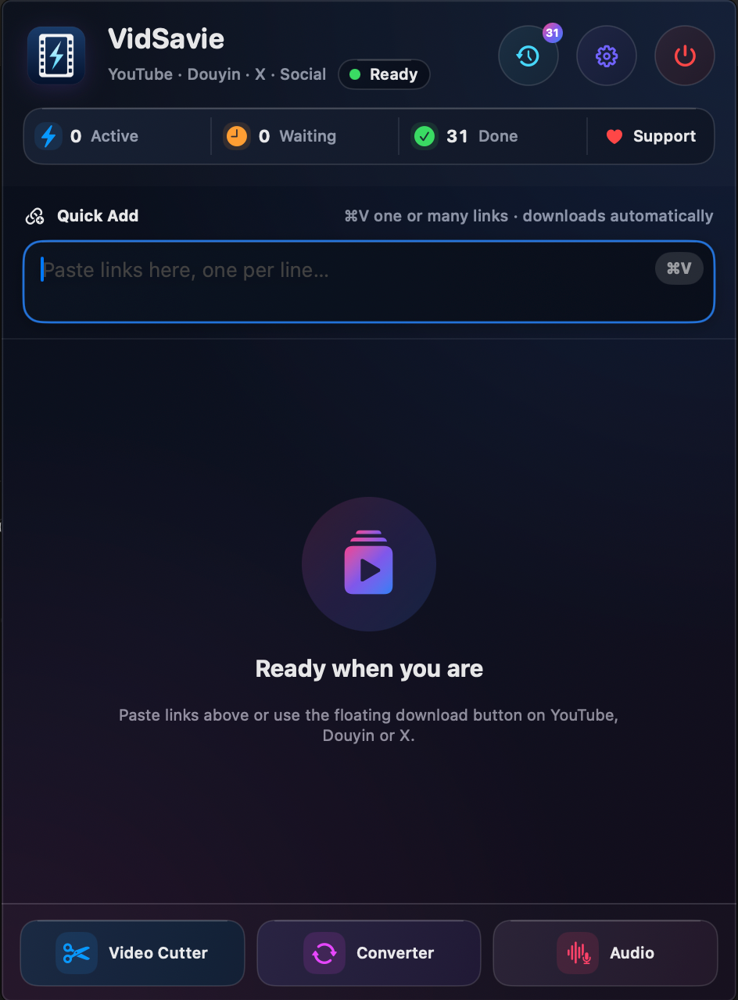
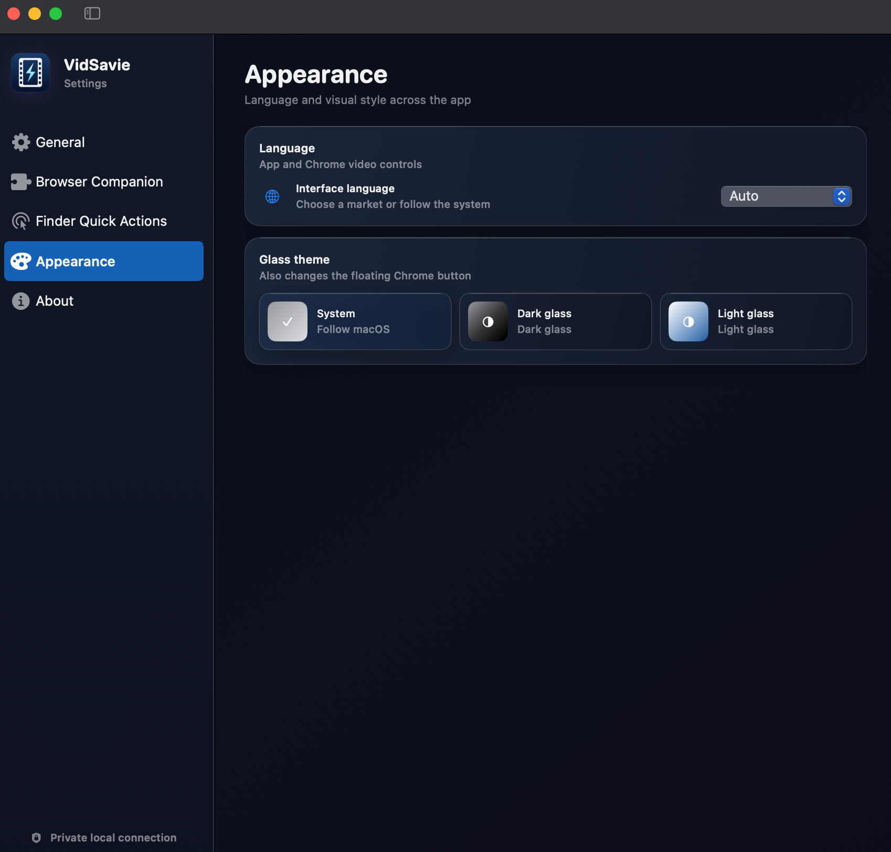
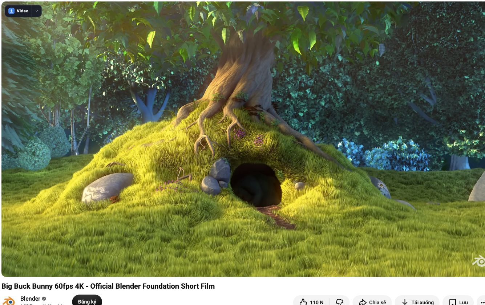
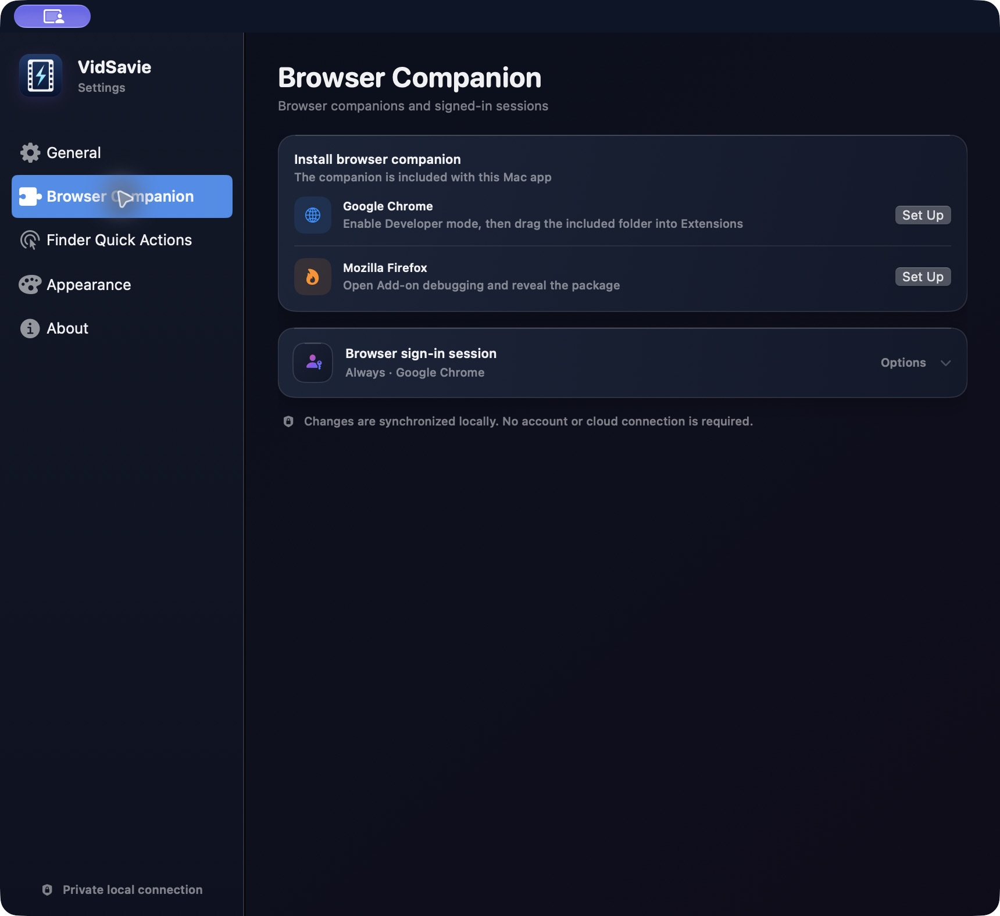
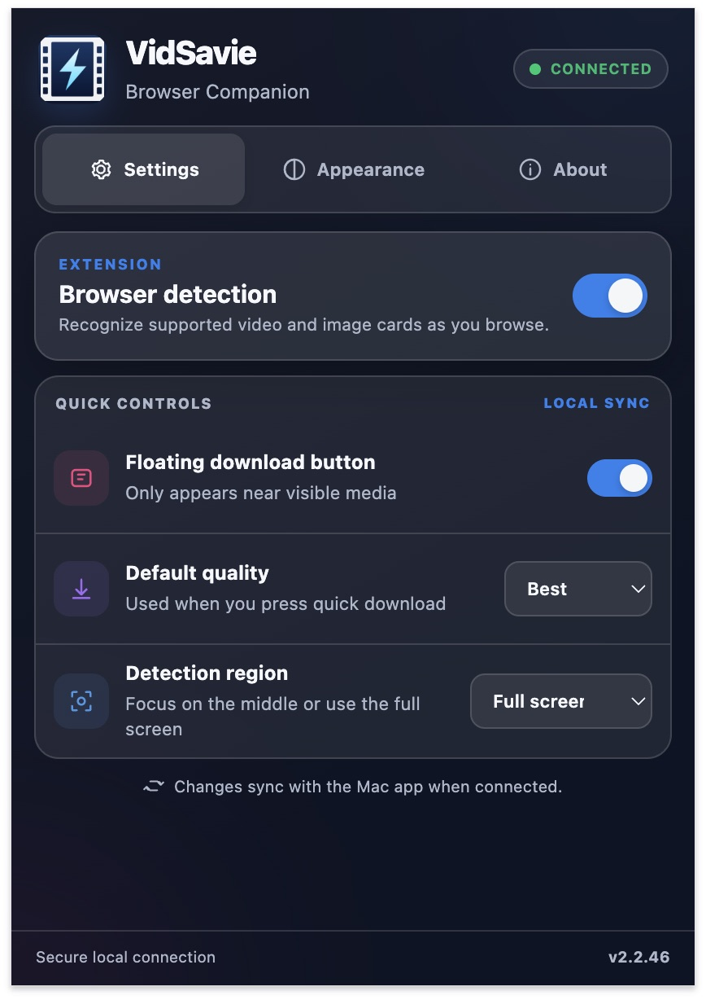

# VidSavie

Save your favorite videos from supported sites, right on your Mac.

A small menu bar app for downloading videos, audio, and images. Paste multiple links to queue downloads, or use the Chrome companion to save supported content from the page you're watching.

Current support includes YouTube, Douyin, Bilibili, X, Facebook, and Instagram. Available download options vary by site; not every video or post can be downloaded.

I built this with help from AI for my own day-to-day work, and I'm sharing it for free with anyone who finds it useful. It's still a work in progress, so let me know if something doesn't work.

## What it does

- Downloads supported content from the sites listed above. Other websites are available through limited, opt-in media detection, not guaranteed download support.
- Queues multiple links and downloads them one at a time.
- Keeps partial downloads after an interruption so you can try continuing, when the source allows it.
- Saves download history and lets you open files or reveal them in Finder.
- Includes tools for cutting video, converting media, and processing audio.
- Offers multiple interface languages and light/dark themes, with settings synced to the browser companion.

The packaged app includes yt-dlp, FFmpeg, and FFprobe. You don't need Homebrew to use it, and you can update the support tools from Settings.

## A quick look



Paste one or more links into **Quick Add** to queue supported downloads. The bottom shortcuts open **Video Cutter**, **Converter**, and **Audio** in separate windows.

<details>
<summary>Languages and appearance</summary>



Choose your interface language and **System**, **Dark glass**, or **Light glass** in Settings. Fresh installations start in English; existing preferences are preserved.

</details>

### Download without leaving the video



Keep VidSavie running, open a supported video, and press **Video** on the floating button. Use the arrow beside it to choose quality or an available media type. The button appears only near eligible media; it isn't a guarantee that every source can be downloaded.

The example shows *Big Buck Bunny* on Blender's official YouTube channel. Video content and platform branding belong to their respective creators, not VidSavie. This is a real interface capture, not a download-success claim.

### Connect the Chrome companion



Open **Settings → Browser Companion → Google Chrome → Set Up**, then follow the four steps below. Chrome is the verified companion workflow; the Firefox entry is not a claim of equivalent tested support.



Click the companion's lightning icon in Chrome to check the connection, toggle the floating button, and choose your default quality. The Mac app needs to stay running for downloads.

## Download and installation

The current package is for **Apple Silicon Macs (M1, M2, M3… / arm64)**. There isn't an Intel build yet.

Download the arm64 DMG and matching checksum from [Releases](https://github.com/Atu96/vidsavie/releases). Open the DMG and drag VidSavie into Applications. To build it yourself, see the section below.

Fresh installations start in English. You can choose another language or System mode in Settings; updates keep your saved language preference.

The included tools are ready to use immediately. On first launch, the app checks for tool updates in the background. If an update or revised build is available, choose **Update tools** or **Later**; it won't install tools without your approval. Later checks run on a 24-hour schedule. An offline check doesn't stop you using the bundled tools. FFmpeg updates currently follow VidSavie's published media profiles, not every upstream release automatically.

### About the macOS warning

I haven't been able to budget for the Apple Developer Program yet, so the current app isn't signed with a Developer ID or notarized by Apple. macOS may show a warning when you try to open it.

I wanted to make that clear before you install it. Only open a copy from a source you trust, and don't disable Gatekeeper across your Mac. If you're unsure, you're welcome to look through the source or wait for a later release.

## Download buttons in Chrome

1. Open the app's Settings, find Browser Companion, and choose the Chrome setup option. The app opens the extensions page and the folder containing `ChromeExtension`.
2. Turn on **Developer mode** at `chrome://extensions`.
3. Choose **Load unpacked** and select the `ChromeExtension` folder bundled with the app.
4. Keep the Mac app running in the background, then reload the video page.

When an app update changes the companion, click **Reload** on its card in the Extensions page. It isn't on the Chrome Web Store yet. Chrome is the main tested setup; Firefox hasn't been verified to the same extent.

## A few things to know

Video sites change often. One successful download doesn't mean every video on that site will work. Some content needs a signed-in browser session, is region-restricted, or is no longer available.

Downloads and media processing run on your Mac. The app still connects to the source sites to fetch content and downloads tools when you update them. You don't need a separate account for this app.

Please only download content you have permission to save and use. If something fails, you can copy the error log from the app when reporting it. Remove any personal information first, and never share cookies or passwords.

## If you'd like to support it

If the app saves you a few clicks each day, you can [buy me a coffee on Ko-fi](https://ko-fi.com/atu1202). It helps me keep working on fixes and improvements.

No pressure. Thanks for trying the app and sharing your feedback. ❤️

## Building from source

You'll need a Swift 6 build environment, a macOS SDK, and Node.js/npm for the tests. The source targets macOS 13 or later; compatibility still needs testing on individual macOS versions.

From the project folder:

```sh
./Scripts/test.sh
./Scripts/build-app.sh
```

The app is created at `.build/app/VidSavie.app`. Run `./Scripts/build-dmg.sh` to create an arm64 DMG in `dist/`. Packaging needs an internet connection to download and verify the bundled tools. Automated tests don't download real videos or read browser cookies.

## License

VidSavie's project-authored source is licensed under **GPL-3.0-or-later**. You may use, modify, share, and sell it under the GPL's terms. See [LICENSE](LICENSE) and [COPYRIGHT](COPYRIGHT) for the full terms and scope. There is no donation requirement or non-commercial restriction.

yt-dlp, FFmpeg, FFprobe, and their dependencies retain their own copyrights and licenses; they are not original VidSavie code. See [Portable tool notices](Resources/ThirdParty/PORTABLE_TOOLS.md) and the [licensing audit](LICENSING-AUDIT.md).

New 2.2.45 builds use an app-specific FFmpeg/FFprobe profile built from pinned source archives, with component notices and a [matching source package](https://github.com/Atu96/vidsavie/releases/tag/media-9.0.2-v1). This does not change the old 2.2.44 installer. **Binary licensing review is still pending** for the yt-dlp standalone dependency-source set and other items detailed in the audit; no comprehensive compliance certification is claimed.

For architecture, testing boundaries, and contribution guidance, see the [developer guide](docs/development/README.md).
